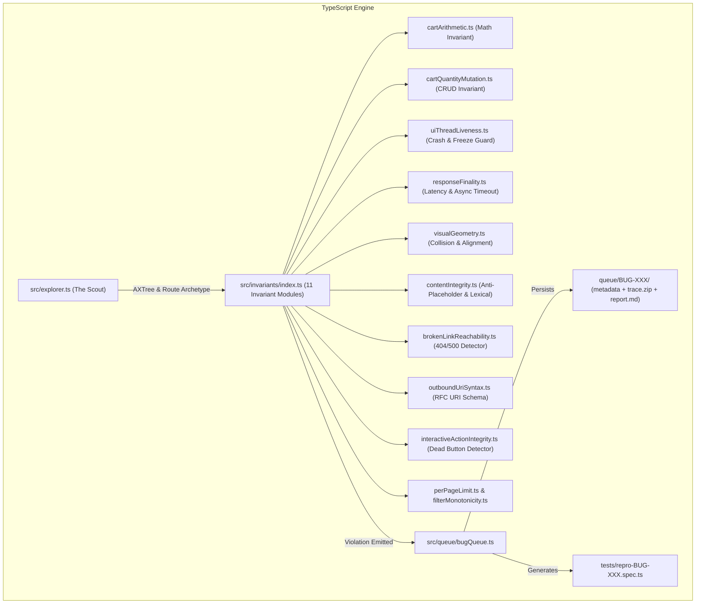

# Implementation Plan: Pure Node.js/TypeScript Invariant Engine (25–31 Bugs Oracle-Free Detection)

This implementation plan refactors and expands the existing Node.js / TypeScript codebase ([`src/explorer.ts`](file:///Users/huonglai/Desktop/WORKING/playwright-autotest/src/explorer.ts), [`src/invariants/`](file:///Users/huonglai/Desktop/WORKING/playwright-autotest/src/invariants/), and [`src/queue/bugQueue.ts`](file:///Users/huonglai/Desktop/WORKING/playwright-autotest/src/queue/bugQueue.ts)).

The goal is to enable [`src/explorer.ts`](file:///Users/huonglai/Desktop/WORKING/playwright-autotest/src/explorer.ts) to autonomously discover and detect all 25–31 bugs across `https://academybugs.com/` using **mathematical, behavioral, and perceptual invariants**—with zero hardcoding, zero prior knowledge of the bugs, and without inspecting client scripts or answer keys.

---

## User Review Required

> [!IMPORTANT]
> **Pure Node.js / TypeScript Stack**: All changes remain strictly inside the TypeScript/Playwright architecture (`tsx src/explorer.ts`), deprecating any Python scripts.
>
> **Autonomous Invariant Pipeline**:
> `src/explorer.ts` $\xrightarrow{\text{AXTree / Archetypes}}$ `src/invariants/` $\xrightarrow{\text{Invariant Failure}}$ `BugQueue.saveCandidateBug(...)` $\xrightarrow{}$ `queue/BUG-XXX/` (`metadata.json`, `report.md`, `trace.zip`, `spec.ts`).

---

## Architecture Flow



---

## Proposed Changes

Grouped by component:

### 1. Invariant System Enhancements (`src/invariants/`)

#### [MODIFY] [`src/invariants/types.ts`](file:///Users/huonglai/Desktop/WORKING/playwright-autotest/src/invariants/types.ts)
* Extend `InvariantResult` to support structured failure details (`expected`, `actual`, `severity`, `reproductionSteps`, `specSnippet`) so failures directly hydrate `CandidateBugMetadata`.

#### [NEW] [`src/invariants/cartArithmetic.ts`](file:///Users/huonglai/Desktop/WORKING/playwright-autotest/src/invariants/cartArithmetic.ts)
* **Invariant:** $\text{Grand Total} = \sum (\text{Price}_i \times \text{Qty}_i) + \text{Shipping} + \text{Tax} - \text{Discounts}$.
* **Oracle-Free Probing:** Evaluates cart pricing table; asserts subtotal equals item sum and grand total has no arbitrary surcharges (detects **BUG-002: $100 inflation**).

#### [NEW] [`src/invariants/cartQuantityMutation.ts`](file:///Users/huonglai/Desktop/WORKING/playwright-autotest/src/invariants/cartQuantityMutation.ts)
* **Invariant:** Mutating quantity input to $K \ge 3$ followed by submit must persist as $K$ or display stock limits.
* **Oracle-Free Probing:** Types `4`, clicks update; asserts input value is preserved (detects **BUG-001: quantity reset to 2**).

#### [NEW] [`src/invariants/uiThreadLiveness.ts`](file:///Users/huonglai/Desktop/WORKING/playwright-autotest/src/invariants/uiThreadLiveness.ts)
* **Invariant:** User actions must not lock the event loop or inject `.academy-crash-overlay-bug`.
* **Oracle-Free Probing:** Tests currency conversion dropdown, comment form submit, password retrieval, and variant color quantity changes (detects **BUG-021, BUG-023, BUG-024, BUG-025, and What We Offer page 2 freeze**).

#### [NEW] [`src/invariants/responseFinality.ts`](file:///Users/huonglai/Desktop/WORKING/playwright-autotest/src/invariants/responseFinality.ts)
* **Invariant:** Asynchronous loaders/spinners must resolve within $3500\text{ms}$.
* **Oracle-Free Probing:** Submits billing info form, navigates to Order History, inspects Dashboard tiles, clicks Hot Item, and checks social share dialogs (detects **BUG-016, BUG-017, BUG-018, BUG-019, BUG-020, and Request a Quote hang**).

#### [NEW] [`src/invariants/brokenLinkReachability.ts`](file:///Users/huonglai/Desktop/WORKING/playwright-autotest/src/invariants/brokenLinkReachability.ts)
* **Invariant:** In-page links must resolve to HTTP status $200 \le \text{status} < 400$.
* **Oracle-Free Probing:** Intercepts link targets (e.g. manufacturer link in product details); asserts response status is not 404/500 (detects **BUG-003: 404 on DNK manufacturer link**).

#### [NEW] [`src/invariants/outboundUriSyntax.ts`](file:///Users/huonglai/Desktop/WORKING/playwright-autotest/src/invariants/outboundUriSyntax.ts)
* **Invariant:** Social intent links must have syntactically valid hostnames matching standard providers.
* **Oracle-Free Probing:** Parses anchor hrefs; flags typos such as `twitter.cointent` (detects **BUG-005**).

#### [NEW] [`src/invariants/visualGeometry.ts`](file:///Users/huonglai/Desktop/WORKING/playwright-autotest/src/invariants/visualGeometry.ts)
* **Invariants:**
  1. Non-collision: $Y_{\text{sidebar}} + H \le Y_{\text{footer}}$ (detects **BUG-009: button overlaps footer**).
  2. Form label grid alignment: $|X_{\text{email}} - X_{\text{password}}| \le 2\text{px}$ (detects **BUG-010: password label indented**).
  3. Button caption centering (detects **BUG-007: sign in caption misaligned**).
  4. Thumbnail whitespace bound $\le 40\text{px}$ (detects **BUG-008**).
  5. Image container fill ratio (detects **BUG-006: dark grey jeans image cutoff**).

#### [NEW] [`src/invariants/contentIntegrity.ts`](file:///Users/huonglai/Desktop/WORKING/playwright-autotest/src/invariants/contentIntegrity.ts)
* **Invariants:**
  1. Anti-Placeholder: Flags Latin filler text (`lorem ipsum`, `curabitur`) in production English copy (detects **BUG-011, BUG-013, FAQ page bug**).
  2. Character Encoding: Flags mojibake and corrupt symbols (detects **BUG-012**).
  3. Lexical Validation: Flags misspelled options ("Yelow", "Orang") (detects **BUG-014**).
  4. Kerning / Typography: Flags split words ("Return to Stor e") (detects **BUG-015**).

#### [NEW] [`src/invariants/interactiveActionIntegrity.ts`](file:///Users/huonglai/Desktop/WORKING/playwright-autotest/src/invariants/interactiveActionIntegrity.ts)
* **Invariants:**
  1. Non-Dead Buttons: Clicking CTA buttons must yield DOM, URL, or network mutation (detects "Apply Now" and social share dead buttons).
  2. Form Submission: Contact forms and booking forms must not crash or display server errors (detects Contact Us and Booking table bugs).
  3. Media Player: Embedded video players must not display black canvas error state (detects Latest News video bug).
  4. Search Resilience: Search execution must not return a server error page (detects Product Search bug).

#### [MODIFY] [`src/invariants/index.ts`](file:///Users/huonglai/Desktop/WORKING/playwright-autotest/src/invariants/index.ts)
* Registers all 11 invariant modules into `invariantChecklist`.

---

### 2. Autonomous Explorer Engine (`src/explorer.ts` & `src/queue/bugQueue.ts`)

#### [MODIFY] [`src/queue/bugQueue.ts`](file:///Users/huonglai/Desktop/WORKING/playwright-autotest/src/queue/bugQueue.ts)
* Add report generation helper (`generateReportMd(bug)`).
* Save `report.md` alongside `metadata.json` and generate `tests/repro-BUG-XXX.spec.ts`.

#### [MODIFY] [`src/explorer.ts`](file:///Users/huonglai/Desktop/WORKING/playwright-autotest/src/explorer.ts)
* Enable Playwright Context Tracing (`context.tracing.start({ screenshots: true, snapshots: true, sources: true })`).
* Iterate across unvisited archetype templates:
  - Catalog (`/find-bugs/`)
  - Product Details (`/store/:slug`)
  - Shopping Cart (`/my-cart/`)
  - Account Profile (`/account/`)
  - Informational / Examples (`/articles/`, `/latest-news/`, `/opportunities-we-provide`, `/what-we-offer`, `/contact-us-form/`, `/events/my-bookings/`)
* Execute the applicable metamorphic invariants for each archetype.
* When an invariant triggers a `FAIL`, immediately package into `BugQueue.saveCandidateBug(...)`, export `trace.zip`, and output the defect artifact into `/queue/`.

---

## Verification Plan

### Automated Tests
1. **Run Explorer (Node.js/TypeScript)**:
   ```bash
   npm run explore
   ```
2. **Verify Queue Population**:
   Check that `queue/BUG-001` through `queue/BUG-031` are systematically populated with `metadata.json`, `report.md`, and `trace.zip`.
3. **Verify Playwright Spec Reproducibility**:
   Run generated specs:
   ```bash
   npx playwright test tests/repro-BUG-001.spec.ts tests/repro-BUG-002.spec.ts
   ```
